# Piranesi's Perspective Trick

This is a quick report explaining what I have been doing with some research on what I started to call 'Piranesi's perspective trick'. In the past I would have written this up as an academic paper, that may happen at some point, but not anytime soon.

Giovanni Battista Piranesi was a Eighteenth century artist famous for his 'vedute' etchings of classical and contemporary buildings in Rome. He wasn't the only artist doing this sort of thing, there was quite an industry around souvenirs of the Grand Tour.

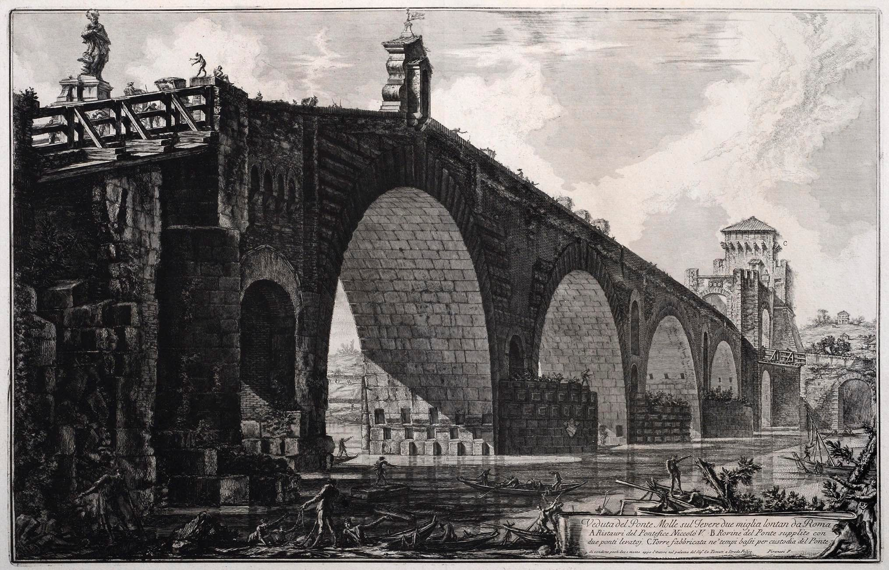

Artistically the images are excellent, and in many ways these etchings are a very good record of the places, as Piranesi was very much concerned with getting the detail right. However there are a few stand-out things about these pictures, and pictures from other artists of the period, that are a little bit strange to our modern eyes that are used to experiencing places through photography:

1. The engravings give a very good impression of the sense of place, we are all used to visiting places that we have previously seen in photographs and found the reality to be very different, whereas Piranesi's places are very identifiable when encountered.

2. Related to this, often the images show a wide panoramic view that is impossible to represent in a single photograph, but without any of the distortions that you see at the edges of a photograph.

3. To a modern eye, brought up with television and magazines, there is something about the perspective in these pictures that looks just a little bit off, or even very wrong, but there is no evidence that people at the time thought like this — Piranesi was famous for his technical ability as a draughtsman.

A few years ago, we were looking at introducing new panoramic projections for the Hugin panorama stitcher, and one of the features often asked for was to have a projection that was very wide-angle, but which didn't have the extreme edge distortions of normal photographic projections, or the awkward curvature that you see in fisheye or map projections, basically what we wanted was a way to recreate these 'vedute' views in software. What we came up with was the 'Panini projection' (sometimes called the 'vedutismo projection', probably a better name, but hey, once you create software, you can't go changing names of things just like that).

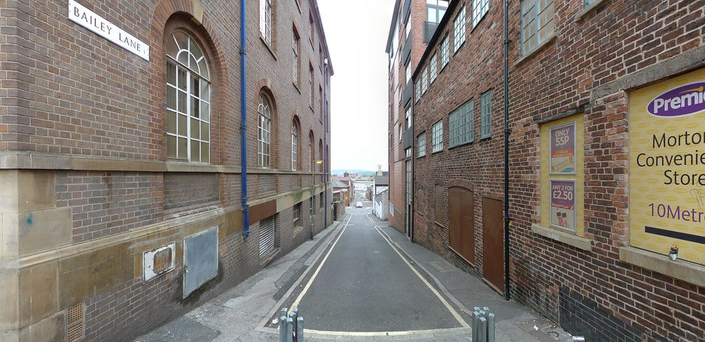

The Panini projection is very useful, and you have probably encountered it at some point without even realising it, it has the property that vertical lines are straight, radial lines are straight, and that edge distortion is imperceptible. With the Panini projection it is possible to show a scene with an enormously wide angle of view (over 180°), and for it to appear like a normal photograph, sometimes, at least.

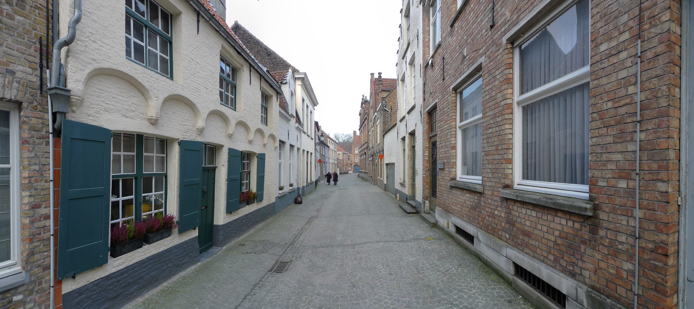

But our Panini projection in Hugin isn't quite the same as the perspective views used by Piranesi and his contemporaries. Although there is a straightforward way to construct a Hugin/Panini perspective on a drawing board, there is no evidence that any of these historical artists actually used it. Some got very close, in particular Panini himself and Vincent van Gogh, but that is a story for another day.

But there is a distinctive feature of Piranesi's perspective trick, a feature that marks it out from Hugin's Panini perspective, and from a normal 'rectilinear' image.

'Rectilinear' is the kind of normal perspective you get from a camera, but also from drawing a perspective by projecting a plan on a drawing board, and also it is the default perspective you get using one of the various historical perspective machines such as a camera obscura.

The distinctive feature of Piranesi's perspective trick is that when you have a series of similar objects receding into the distance, such as houses or arches in a bridge, the nearer versions are just drawn as larger versions of those in the distance — real perspective doesn't work like this, not at all, this is a trick that Piranesi and other artists used to cram more things into the pictures while retaining legibility.

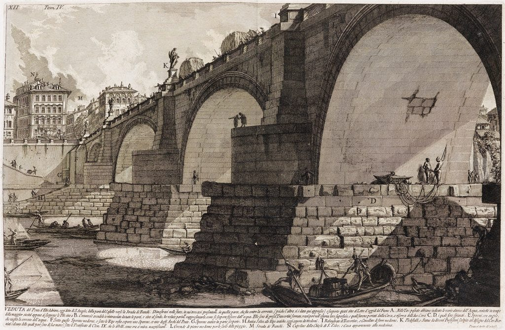

The way to spot it involves drawing some lines on the picture, use a copy, it is best not to use an original.

In a normal perspective, any parallel lines in the scene that are not perpendicular to the viewing direction converge onto points. This sounds complex, but it is not, here is what we call a one-point perspective. The edges of the buildings converge to a single 'vanishing point' on the horizon, this is why we call it 'one point perspective'.

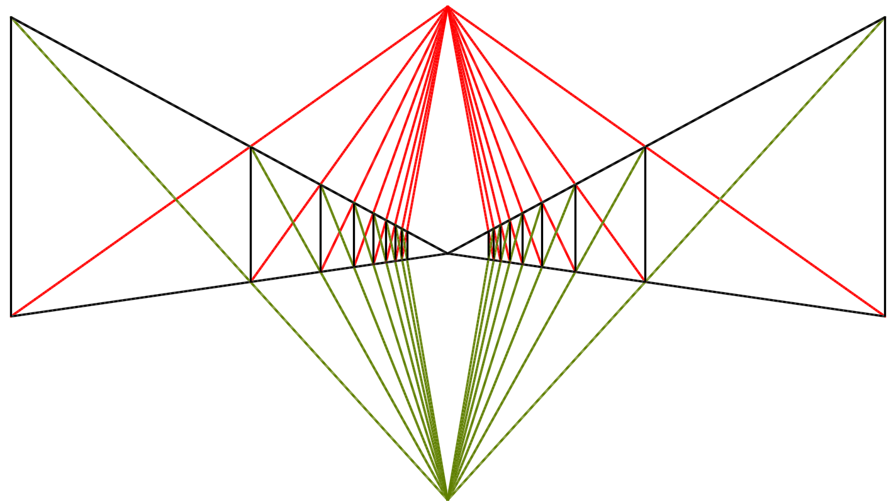

But other parallel lines in the scene also converge to points, the diagonals of the buildings are also parallel, and so when shown in perspective they converge on points directly above and below the main vanishing point.

But look at one of Piranesi's engravings:

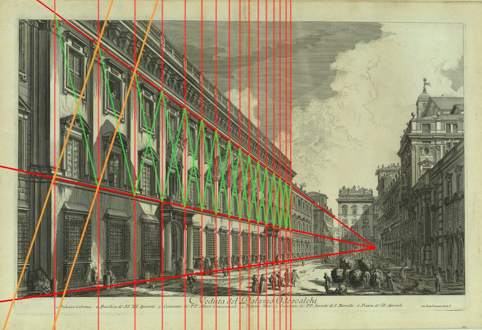

Some of the diagonals, towards the middle of the image, do the right thing, they converge top and bottom as expected, but the diagonal lines at the left of the scene are drawn completely parallel. This is outrageous! real, true perspective doesn't work like this, it isn't possible to construct a camera or a computer program to render a view that does this. But the engravings work as pictures nonetheless, in fact they are quite good.

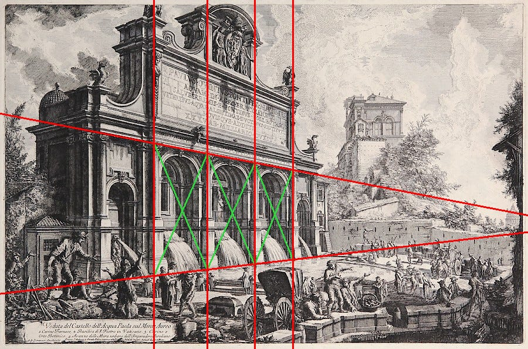

This one below is a Canaletto, the same trick is in use, the centre and right hand part of the picture is photographically correct, but the long building on the left has been extended using Piranesi's perspective trick. I've drawn diagonals on each bay of the building and they are obviously parallel. If this was a true perspective these diagonal lines would converge into a vanishing point in the sky somewhere above St Mark's.

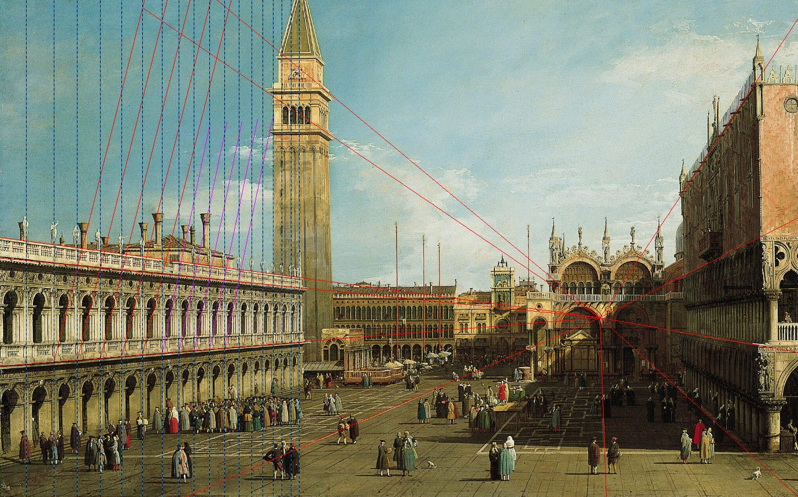

The mathematics of this is quite simple, just draw objects in a series such that the closer ones are the same proportion as those further away. You can show that the only way to do this is is for the ratio of the distance from the vanishing point to any two features is the same for the next two features.

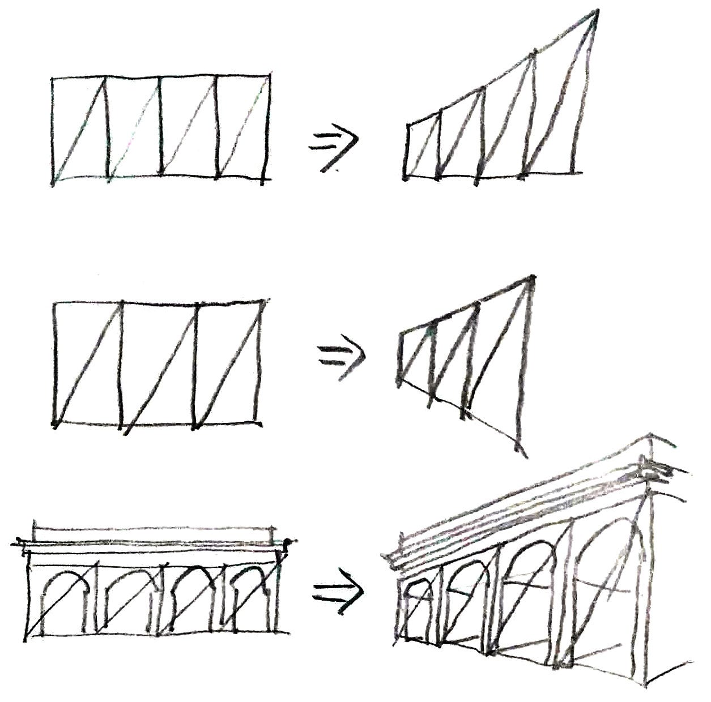

Here's the science bit:

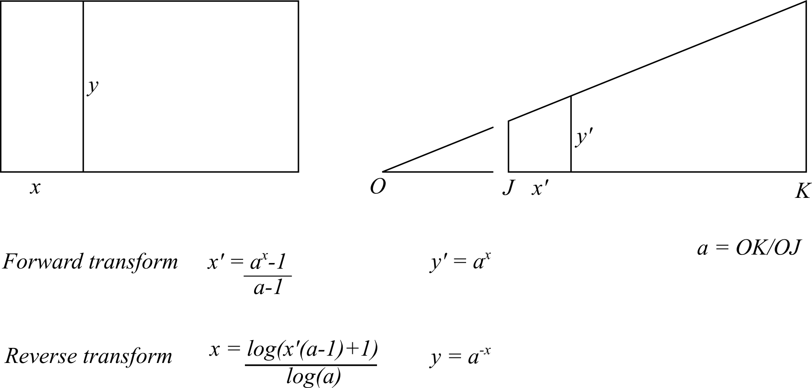

…and here are some tests, with Panini's perspective trick we can't render the entire scene, just rectangular objects in a scene, rectangular objects like the elevation of a street. This is a street elevation:

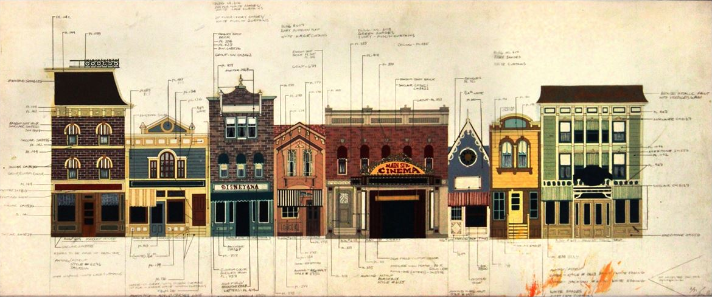

Here is the same elevation distorted using Piranesi's perspective trick, looks ok to me, it's a first test so is a bit blurry.

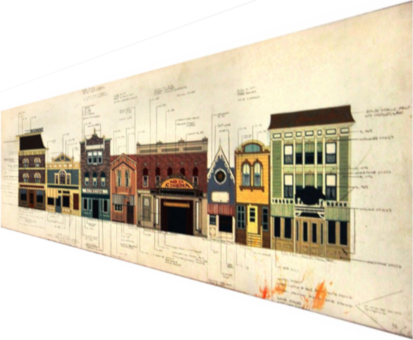

But here is the same elevation drawn using correct rectilinear perspective. I hope you will agree that the Piranesi version is much more legible, the furthest house above is easier to see and the nearest house isn't horribly distorted as it is below.

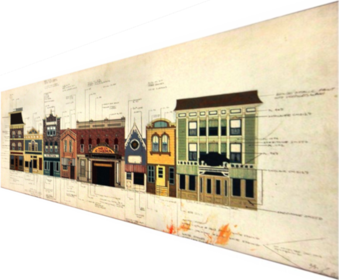

By legibility I mean that the Piranesi distortion is easier to read, and that to anyone unfamiliar with photographs, that hasn't grown up with TV, photographs and magazines, the Piranesi version would look much better, and the true perspective would look rather odd.

So what can we do with this? We can't add this trick to Hugin as a new general purpose mapping, because it isn't a real perspective. However most image editors, like GIMP, have a perspective tool that performs a distortion on a rectangular selection, technically this is called a 'homography matrix transform' and it produces a photographically correct rectilinear perspective, with all the usual unpleasant edge distortions.

Piranesi's perspective trick can also be extended into two dimensions like this, sometimes called a 'two point perspective'. Piranesi never did this, but with computers we can do all sorts of things. So here is a general 2D remapping as a prototype replacement for the perspective tool in image editors (I have no ability to add this to GIMP, somebody else needs to step up):

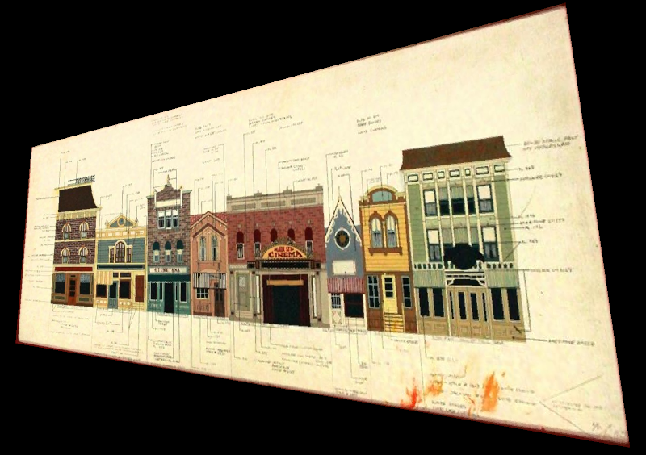

I think that the result is much more legible than that produced by a 'true' perspective, no matter how correct it is:

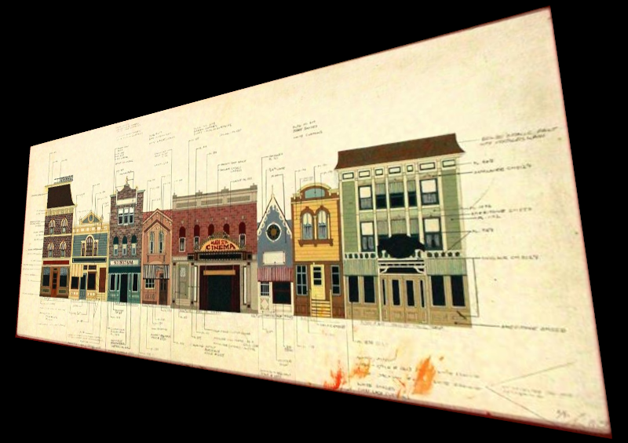

Once you know what to look for, i.e parallel diagonal lines, you can see Piranesi's trick being used by any number of historical artists, and even some modern artists, this isn't 'lost' knowledge.

The trick was very common as a way to show a birds-eye aerial view of landscapes, but also keeping them legible enough to be used as a map, like this:

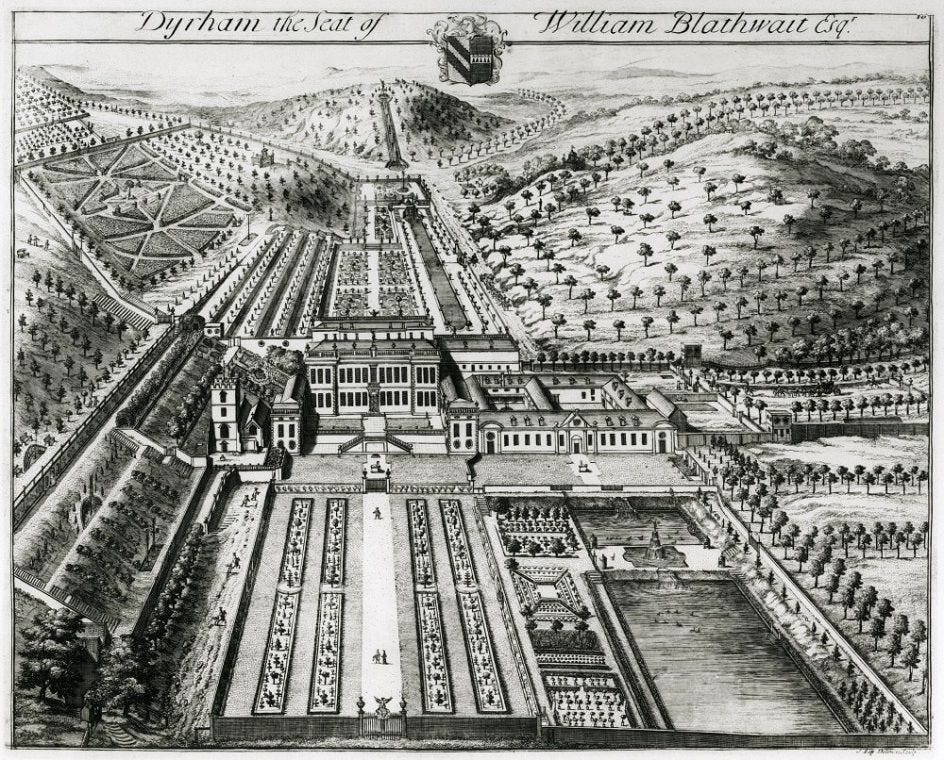

We can do this in the computer, here is a birds-eye view of a London map redrawn using Piranesi's perspective trick.

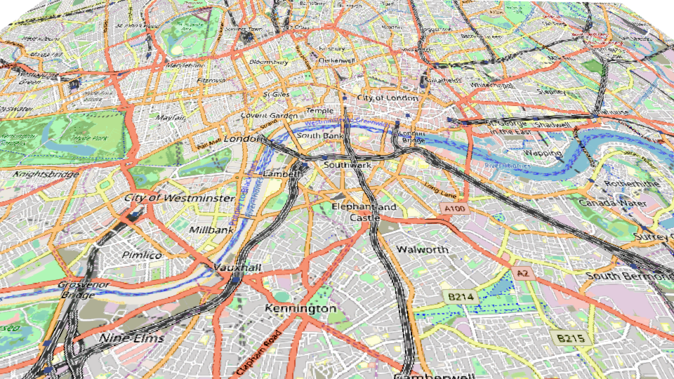

I hope you will agree that it is quite a bit more legible than the same view shown in 'correct perspective':

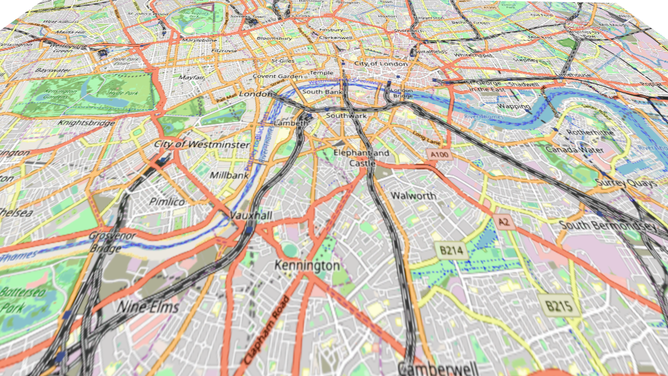

'Correct' birds-eye perspective, OSM contributors

..and so this article doesn't finish on a boring picture, here is some lineart remapped using Piranesi's perspective trick. The thing to note is that the left building has basically the same amount of distortion as the right building, only smaller. Similarly, all the windows have about the same amount of distortion, this is very very unlike a true, 'correct' perspective:

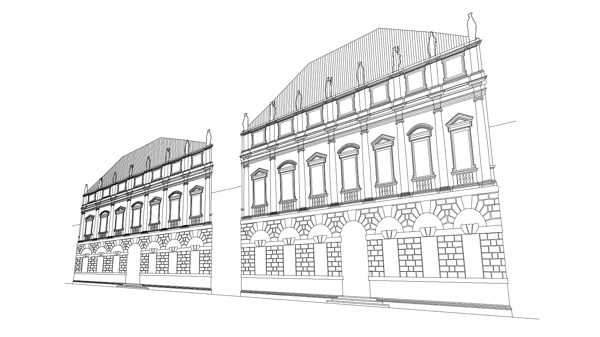

Bruno Postle, April 2019
